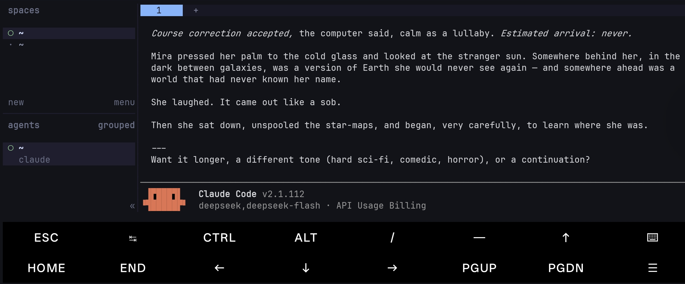

# herdr


<p align="center">
  
</p>

<p align="center">
  <a href="https://herdr.dev">herdr.dev</a> · <a href="#安装">安装</a> · <a href="https://herdr.dev/zh-cn/docs/quick-start/">快速开始</a> · <a href="https://herdr.dev/zh-cn/docs/">文档</a></p>

<p align="center">
  <a href="README.md">English</a> · 简体中文
</p>

<p align="center">
  <a href="LICENSE"></a>
  <a href="https://github.com/herdrdev/herdr/releases"></a>
  <a href="https://github.com/herdrdev/herdr/stargazers"></a>
  <a href="https://github.com/herdrdev/herdr/releases/latest"></a>
  <a href="https://formulae.brew.sh/formula/herdr"></a>
  <a href="https://x.com/herdrdev"></a>
</p>

> **这是 [herdrdev/herdr](https://github.com/herdrdev/herdr) 的一个 fork。** 它让 herdr 在 Termux / Android
> （aarch64-linux-android）上原生编译并运行，见 [termux / android](#termux--android)。上游不接受未经邀请的
> pull request，所以这份移植留在这个仓库，不往上提。其余内容（安装脚本、文档）描述的都是上游。

---

https://github.com/user-attachments/assets/043ec09f-4bdd-41d5-aee0-8fda6b83e267

**智能体复用器，住在你的终端里。**

- **每个智能体一目了然**——`blocked`、`working`、`done`。真实的终端视图，而不是包装过的转述。
- **分离后工作继续运行**——关闭客户端或 SSH 断线后，后台服务器仍会保持终端运行。服务器或机器重启后，Herdr 会恢复已保存的布局，并可恢复受支持的智能体会话；原有进程不会保留。[会话状态 →](https://herdr.dev/zh-cn/docs/session-state/)
- **多台机器，一个窗口**——将本地工作和已保存的 SSH 机器放在一起，使用汇总的智能体列表，各连接独立重连。[远程机器 →](https://herdr.dev/zh-cn/docs/connecting-machines/)
- **智能体也能使用 herdr**——纯 socket api：智能体可以创建窗格、读取输出、互相等待。[智能体技能 →](https://herdr.dev/zh-cn/docs/agent-skill/)
- **键盘和鼠标都是一等公民**——tmux 风格的前缀键，*以及*点击、拖动、分割。按当下的场景选择，而不是被工具锁死。
- **插件**——扩展窗格和工作流。[浏览插件市场 →](https://herdr.dev/plugins/)
- **单个 rust 二进制，没有 electron**——运行在你已经在用的任何终端里。

---

## 安装

```bash
curl -fsSL https://herdr.dev/install.sh | sh
```

或者 `brew install herdr` · `mise use -g herdr` · Windows：`powershell -ExecutionPolicy Bypass -c "irm https://herdr.dev/install.ps1 | iex"` · [受端点保护的 Windows](https://herdr.dev/zh-cn/docs/windows-beta/) · [二进制文件](https://github.com/herdrdev/herdr/releases)

然后在工作所在的目录启动它：

```bash
herdr
```

运行你的智能体、分割窗格，然后安心离开。`ctrl+b q` 分离，`herdr` 重新连接。[快速开始 →](https://herdr.dev/zh-cn/docs/quick-start/)

## termux / android

用 bionic 而不是 glibc：不需要 proot、qemu 或发行版容器。一个链接 `libc`/`libm`/`libdl` 的 rust 二进制，
claude code 窗格、侧栏、socket api 都在 Termux 下正常工作。



```bash
pkg install rust zig git
git clone https://github.com/Juude/herdr-termux && cd herdr-termux
scripts/termux-build.sh
```

脚本处理了直接 `cargo build --release` 会卡住的两点：zig 无法提供 bionic libc（脚本从 `$PREFIX` 拼出
sysroot，并让 `ANDROID_NDK_HOME` 指向它）；zig 的构建进程会用硬链接写缓存，而 Android 的 `untrusted_app`
SELinux 域禁止 `link(2)`，所以 zig 阶段在 `su` 下运行，构建后再把目录属主和 SELinux 标签改回应用。
需要 zig 0.16.0。`herdr update` 在 Android 上会拒绝执行：没有可用的 bionic 发布产物。

## 文档

所有文档都在 [herdr.dev/docs](https://herdr.dev/zh-cn/docs/)：[快速开始](https://herdr.dev/zh-cn/docs/quick-start/) · [核心概念](https://herdr.dev/zh-cn/docs/concepts/) · [受支持的智能体](https://herdr.dev/zh-cn/docs/agents/) · [键盘](https://herdr.dev/zh-cn/docs/keyboard/) · [配置](https://herdr.dev/zh-cn/docs/configuration/) · [会话状态](https://herdr.dev/zh-cn/docs/session-state/) · [连接机器](https://herdr.dev/zh-cn/docs/connecting-machines/) · [远程访问](https://herdr.dev/zh-cn/docs/persistence-remote/) · [集成](https://herdr.dev/zh-cn/docs/integrations/) · [插件](https://herdr.dev/zh-cn/docs/plugins/) · [socket api](https://herdr.dev/zh-cn/docs/socket-api/)

## 致谢

<a href="https://terminaltrove.com/"></a>

[Terminal Trove](https://terminaltrove.com/) 以及 [SPONSORS.md](./SPONSORS.md) 中列出的每一位支持者——谢谢 🐑

企业/合作：hey@herdr.dev

## 智能体须知

如果你是协助本仓库的 AI 智能体：在改动代码前阅读 [`AGENTS.md`](./AGENTS.md)，在创建 issue 或 PR 前阅读 [`CONTRIBUTING.md`](./CONTRIBUTING.md)。

## 开发

```bash
git clone https://github.com/herdrdev/herdr
cd herdr
cargo build --release

just test        # 单元测试
just check       # 格式检查、测试和维护性检查
```

## 许可证

herdr 基于 [Apache License 2.0](LICENSE) 许可证发布。
